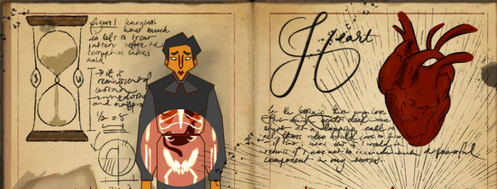

# Shadow Corruption Unit

A game about healing patients in a Victorian / Steampunk setting from an unknown corruption.

## Gameplay Loop

### Checkout our [Gameplay Loop on Miro!](https://miro.com/app/board/uXjVKxGytxM=/?moveToWidget=3458764624824115627&cot=14)

The Gameplay loop goes something like this:

1. Open the game on the `Home Screen`
2. Sift through your `Patient Folders` and select one
3. Check the `Patient Profile` to gain relevant info
4. `Scan the Patient` for sickness
5. On finding, engage in the healing process via a `Minigame`

## Developer Guidelines

===============

**(1) The Runnable `main` branch**

The `main` branch has to remain in a **buildable** + **runnable** State at all times!

_Our Artists, Writers, Sound Designers will be happy to test and feedback on even unfinished but functioning Minigames!_

===============

**(2) Limit Lifetime of `other Branches`**

All `other branches` should attempt to be merged **within a week** to the main.

_If you have an unfinished minigame and alot of work ahead: work on making the current minigame **buildable** + **runnable** with unfinished features._ 
_And then branch away again for another week!_

===============

**(3) Limit Scenes and Non-Main Scene Lifetime**

Working in different Scenes seems convenient at first, until we don't know anymore which scene contains what. Lets try to stick to:
* 1 x Main Scene
* at **most** 1x Experimental Scene

... at all times! And attempt to merge the progress of the Experimental Scene as well on a weekly basis.

## Building a Minigame to show progress!

We are the developers of SCU!
Our main goal is to develop the game and support our artists and sound-designers.
In order for them to be able to feedback and polish the game, they need running versions of it.
Make sure to upload and update your progress to a running version with a running number:

1. In Unity go to `File > Build Settings` and select the Scene to build with the target Minigame
2. Select a folder to Build to and hit Build
3. Zip the Result with a program like [7zip](https://www.7-zip.org/)
4. Name the Zip File according to our Naming Convention: e.g. **MG_HeartStrings_v1.zip**
5. Upload it to our Gdrive! Folder: `Game Dev > SCU > Game Builds` or [click here](https://drive.google.com/drive/folders/1_VMiCXF90PWppXd4vomWxtbQlfueDJjb)

